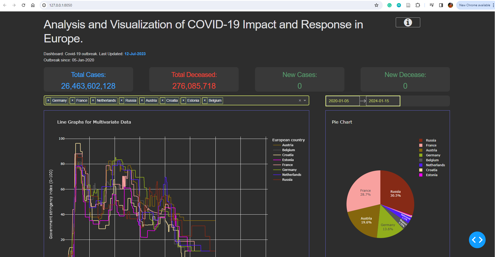
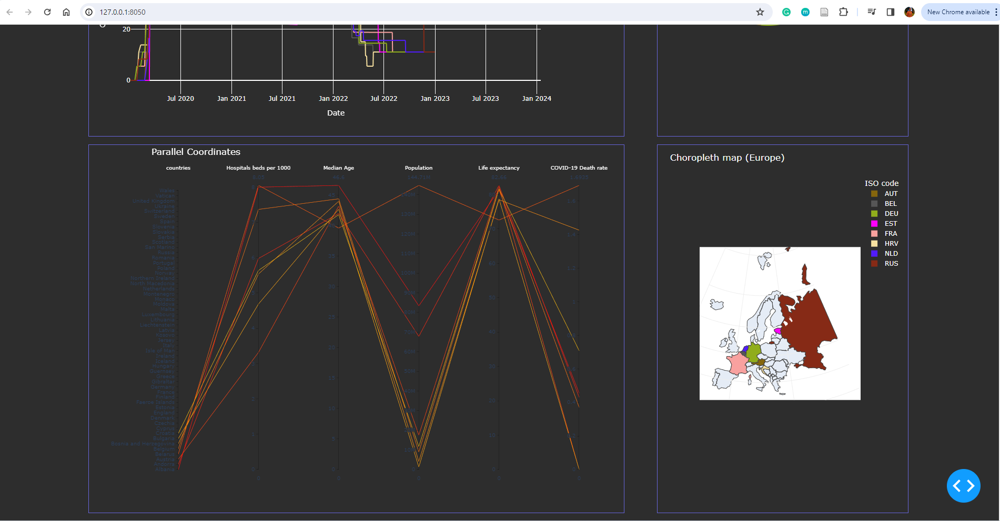

# Analysis and Visualization of COVID-19 Impact and Response in Europe.

[](https://www.python.org/)
[](https://pypi.org/project/dash/2.7.0/)
[](https://pypi.org/project/Flask/2.2.5/)
[](https://pypi.org/project/plotly/5.9.0/)
[](https://pypi.org/project/pandas/)
[](https://pypi.org/project/numpy/)


## Table of Contents
1. [Introduction](#introduction)
2. [Tasks](#tasks)
3. [How To Run](#how-to-run)
4. [Results](#results)
5. [Acknowledgements](#acknowledgements)
6. [License](#license)

## Introduction
As part of the Master Course [Interactive Data Visualization](https://cs.uni-paderborn.de/en/cgvb/lehre/vergangene-semester/ss-20/interactive-data-visualization) at Paderborn University, we need to do a mini-group project on the topic "COVID-19" pandemic.

Group Members: [Varun Golani](https://github.com/vargo96), [Lalith Sagar](https://github.com/Lalith-Sagar-Devagudi), [Sanjay Gupta](https://github.com/sanjaycg486).

We used the following data source to perform our task:

Dataset: [Our World in Data (University of Oxford)](https://ourworldindata.org/coronavirus)

## Tasks

1. **Line graph for Multivariate Data plot** (Varun Golani): This plot is designed to analyze the effectiveness of the measures imposed by the government in EU countries. With the addition of a location dropdown, you can now select a specific country to view its data. The date filter allows you to narrow down the time period for the analysis.

2. **Parallel Coordinates plot** (Lalith Sagar): This plot provides insights into how the hospital systems (i.e., number of beds) in EU countries affect the death rate and the pattern between median age, population, and death rate. The location dropdown allows you to select a specific country, and the date filter lets you choose a specific time period for the analysis.

3. **Pie Chart plot** (Varun Golani): This plot shows the percentage of tests carried out by each country compared to the whole of Europe. The more tests performed in a country, the more reliable the numbers (i.e., total cases) are. With the location dropdown, you can now select a specific country to view its data. The date filter allows you to narrow down the time period for the analysis.

4. **Choropleth map plot** (Sanjay Gupta): This plot visualizes the death rate of COVID-19. The map of EU countries is colored based on the death rate. The location dropdown and date filter allow you to view the death rate for a specific country during a specific time period.

By providing a location dropdown and date filter, we have made the visualization more interactive and user-friendly. Users can select a specific country and time period for a more focused analysis. This makes our visualization a powerful tool for understanding and responding to the COVID-19 pandemic.

**Note:** Please refer to the [COVID-19-Concept-paper.pdf](COVID-19-Concept-paper.pdf), [COVID-19-Basic-Information-Sheet.pdf](COVID-19-Basic-Information-Sheet.pdf), and [COVID-19-presentation.mp4](COVID-19-presentation.mp4) for more details.

## How To Run

This project uses Conda for managing environments and dependencies. The [`environment.yaml`](environment.yml) file contains the list of all dependencies needed to run the project.

Follow these steps to run the project:

1. **Install Conda**: If you haven't installed Conda yet, you can download it from [here](https://docs.conda.io/projects/conda/en/latest/user-guide/install/index.html). Follow the instructions for your specific operating system.

2. **Create a Conda environment**: Navigate to the project directory in your terminal and run the following command to create a new Conda environment based on the [`environment.yaml`](environment.yml) file:

    ```bash
    conda env create -f environment.yaml
    ```

    This will create a new Conda environment with the name specified in the [`environment.yaml`](environment.yml) file.

3. **Activate the Conda environment**: Use the following command to activate the newly created environment:

    ```bash
    conda activate covid-19
    ```    

4. **Run the project**: Now that the environment is set up and activated, you can run the project. If it's a Python script, use the following command:

    ```bash
    python COVID-19.py
    ```    

Remember to deactivate the Conda environment once you're done by using the `conda deactivate` command.

**Note:** To view the dash output, just open the link http://127.0.0.1:8050/ in the browser after running the [COVID-19.py](COVID-19.py) file.

## Results

The following images show the results of the COVID-19 Analysis in Europe in dashboard:





## Acknowledgements

This app was motivated by a Dash template from [this repository](https://github.com/Unicorndy/covid19_dashboard/tree/master).

## License

This project is licensed under the MIT License - see the [LICENSE](LICENSE) file for details.
